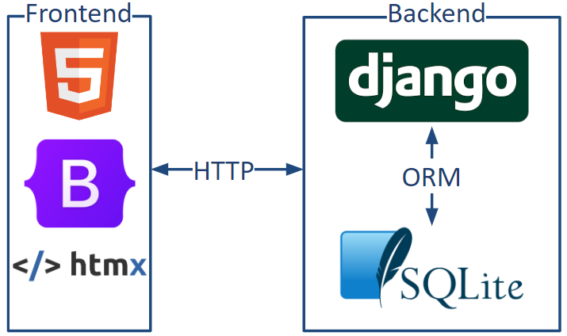
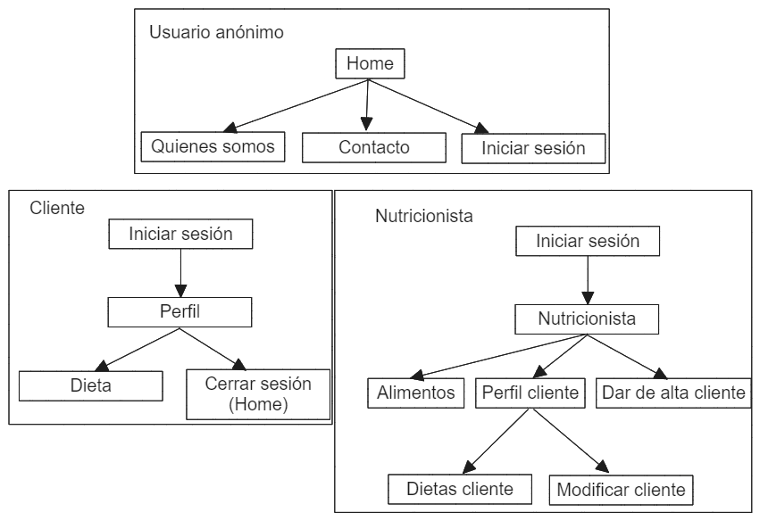

---
version: "1"
title: Ingeniería Web
subtitle: Proyecto nutricionista
author: Diego Sanz Fuertes | 825015
date: 8 de enero de 2024
toc: true
toc-own-page: true
lang: es-ES
table-use-row-colors: false
listings: true
template: eisvogel
output: output.pdf
listings-disable-line-numbers: true
titlepage: true
variables:
  float-placement-figure: H

output:
  pdf:
    template: eisvogel
    output: output.pdf
    from: markdown
    listings: true
    citeproc: true
    
#cp /mnt/c/Users/Diego/ingenieria-web/README.md /mnt/c/Users/Diego/ingenieria-web/*.png . && docker run --rm --volume "`pwd`:/data" --user "root" pandoc/extra README.md -o pdf.pdf -N --template="eisvogel" --listings && cp pdf.pdf /mnt/c/Users/Diego/ingenieria-web/
...

# Índice
- [Introducción, Motivación y Objetivos](#introducción-motivación-y-objetivos) 
- [Estado del arte](#estado-del-arte)
- [Presentación de la propuesta](#presentación-de-la-propuesta)
- [Arquitectura propuesta](#arquitectura-propuesta)
  - [Servidor](#servidor)
  - [Cliente](#cliente)
- [Arquitectura de contenidos](#arquitectura-de-contenidos)
- [Ingeniería de requisitos](#ingeniería-de-requisitos)
  - [Público objetivo](#público-objetivo)
  - [Historias de usuario](#historias-de-usuario)
  - [Iteraciones](#iteraciones)
- [Detalles de la implementación](#detalles-de-la-implementación)
- [Referencias](#referencias)
- [Anexo: Instalación](#anexo-instalación)
  - [Desarrollo](#versión-de-desarrollo)
  - [Producción](#versión-de-producción)
- [Anexo: Mockups](#anexo-mockups)
- [Anexo: Historial](#anexo-historial)

# Introducción, Motivación y Objetivos 

Debido a la importancia de las aplicaciones web en el ámbito del desarrollo de software, permitiendo ser accedidas desde la mayoría de dispositivos, en este proyecto se pretende crear una aplicación web utilizando las principales tecnologías front end (HTML, CSS y JS) y un framework en el backend (Django).

Esta práctica se motiva por la necesidad de aprender a diseñar un proyecto web e implementarlo ya que requiere de conceptos realmente útiles para un ingeniero informático.

Los objetivos de este proyecto son:
- Realizar un análisis de requisitos y definir iteraciones
- Crear una aplicación web responsive siguiendo las iteraciones

La aplicación web se encuentra desplegada en http://155.210.71.122/es/ y el código fuente, incluyendo esta memoria, se encuentra disponible alojada en https://github.com/ElDigoXD/ingenieria-web , donde se puede consultar el historial de cambios.

# Estado del arte

Existen varias páginas web relacionadas con servicios de nutrición online como [Yo Elijo Cuidarme](https://sdo.yoelijocuidarme.es), [Carla Mi Nutricionista](https://carlaminutricionista.com) y [Ana Maté Dietista Nutricionista](https://anamatedietista.com). Éstas se centran en ofrecer un servicio completamente online e incluyen blogs con contenido educacional.

En este proyecto se propone una aplicación web como apoyo a las sesiones presenciales, comparado con las existentes, que se centran en sesiones online.

# Presentación de la propuesta

La propuesta se basa en la proporcionada por los profesores sobre un sistema de nutrición.

Se toman las siguientes consideraciones respecto a la propuesta proporcionada:

- Las consultas de los clientes con el nutricionista son presenciales.
- El objetivo del sistema es realizar un seguimiento de los clientes y generar dietas para ellos, las cuales podrán consultar.
- Los alimentos proporcionados se encuentran normalizados, es decir, todas las medidas se realizan sobre 100g, por lo que se tendrán que crear platos o raciones.

# Arquitectura propuesta



La arquitectura propuesta se basa en una arquitectura web cliente-servidor, en la que el cliente se comunica con el servidor mediante HTTP.

## Servidor

El servidor (o backend) se desarrollará mediante el framework [Django](https://www.djangoproject.com/), el cuál es el más popular para el lenguaje [Python](https://www.python.org/). Esta elección se motiva por el conocimiento previo del autor y su popularidad. Este framework provee una arquitectura modelo-vista-controlador (MVC) y consta de funcionalidades como enrutamiento, ORM, plantillas y muchas otras que pueden ser encontradas en otros frameworks de backend (como Laravel). Además, permite el uso de extensiones para ampliar sus funcionalidades. Las principales extensiones utilizadas son:

- [Django-htmx](https://github.com/adamchainz/django-htmx): Conveniencia con una librería del frontend.
- [Django-Rosetta](https://django-rosetta.readthedocs.io): Interfaz para la internacionalización y localización.

## Cliente

El cliente (o frontend) se desarrollará mediante las plantillas ofrecidas por Django, las cuales extienden y generan HTML. Se utilizará CSS para los estilos con la ayuda de la popular librería [Bootstrap](https://getbootstrap.com/), la cuál reduce la necesidad de escribir hojas de estilos gracias a las clases predefinidas que incluye. Por último se utilizará JavaScript para ofrecer una interfaz más dinámica y algunas librerías como una extensión para algunas funcionalidades de Bootstrap, [Chart.js](https://www.chartjs.org/) para la creación de gráficos y [htmx](https://htmx.org). Esta última librería permite, principalmente, sustituir partes de la pagina web por HTML ofrecido por el servidor. 

# Arquitectura de contenidos



# Ingeniería de requisitos

## Público objetivo

### Visitante / Anónimo

- Ver página de:
  - Inicio
  - Quienes somos
  - Contacto

### Cliente / Registrado

- Iniciar sesión
- Consultar dieta
- Consultar evolución
- Añadir seguimiento

### Nutricionista / admin

- Iniciar sesión
- Gestionar clientes 
- Proveer nivel de actividad (nulo, moderado, elevado, intenso)
- Generar serie de alimentos para 5 comidas
- Gestionar alimentos
- Consultar histórico dietas
- Evolución del cliente
- Copiar y modificar dietas.

## Historias de usuario

Los criterios se validarán junto al usuario en pruebas de funcionalidad.

1. **Como** visitante **quiero** ver la pagina de inicio **para** informarme sobre el servicio
  - Criterios:
    - La página de inicio contiene información sobre el servicio
    - Permite acceder a una página de contacto
    - Permite acceder a una página de _about me_

2. **Como** visitante **quiero** contactar con el nutricionista **para** obtener más información y/o convertirme en cliente
  - Criterios:
    - La página de contacto proveerá información de contacto del nutricionista

3. **Como** cliente o nutricionista **quiero** iniciar sesión **para** acceder al servicio
  - Criterios:
    - Todas las páginas accesibles sin iniciar sesión contendrán una manera de hacerlo.
    - Se podrá cerrar sesión desde esas páginas una vez iniciada.

4. **Como** cliente **quiero** consultar la dieta **para** alimentarme correctamente
  - Criterios:
    - La página del usuario contiene información sobre su dieta activa

5. **Como** cliente o nutricionista **quiero** consultar la evolución **para** comprobar si mejora
  - Criterios:
    - La página del usuario contiene información sobre su evolución

6. **Como** nutricionista **quiero** gestionar clientes **para** dar de alta, dar de baja y modificar los datos de mis clientes 
  - Criterios:
    - Poder dar de alta clientes con su:
      - nombre
      - teléfono
      - peso
      - altura
      - correo
      - nivel de actividad
    - Poder dar de baja a clientes
    - Poder modificar los datos de los clientes

7. **Como** nutricionista **quiero** generar series de alimentos para 5 las comidas del cliente **para** optimizar su ingesta de calorías
  - Criterios:
    - Poder generar una lista de alimentos basada en:
      - grasas
      - proteínas 
      - hidratos de carbono

8. **Como** nutricionista **quiero** gestionar los alimentos **para** crear, modificar las propiedades y eliminar alimentos.
  - Criterios:
    - Poder:
      - Crear
      - Modificar las propiedades
      - Y eliminar alimentos

9. **Como** nutricionista **quiero** ver dietas anteriores del cliente, copiar y modificar dietas **para** no tener que crearlas desde cero
  - Criterios:
    - Poder ver un historico de dietas del cliente
    - Copiar dietas
    - Modificar dietas

## Iteraciones

### Iteración 1

Implementar la página web base funcional que permita a los visitantes anónimos cumplir todas sus historias.

- Historias: 1, 2
- Crear plantilla base de la página
- Implementar página de inicio
- Implementar página about me
- Implementar página contacto

### Iteración 2

Implementar login, sesiones y autenticación para diferenciar los roles.

- Historias: 3
- Implementar pagina de login
- Implementar botón de logout
- Crear la base para una página "home" personalizada dependiendo del rol

### Iteración 3

Implementar CRUD de los usuarios (nutricionista)

- Historias: 6
- Implementar página de gestión de usuarios con posibilidad de CRUD

### Iteración 4

Implementar seguimiento del cliente (cliente y nutricionista) 

- Historias 5
- Implementaa página del usuario con información sobre su evolución
- Permitir al usuario registrar su evolución

### Iteración 5 (Revisable) 

Crear CRUD de los alimentos

- Historias 8
- Cargar los alimentos en la BBDD
- Implementar página de gestión de alimentos con posibilidad de CRUD
- Posibilidad de crear _raciones_

### Iteración 6 (Revisable) 

Implementar la CRUD de las dietas

- Historias: 4, 9
- Implementar CRUD de dietas para el nutricionista (nutricionista)
- Implementar copia de dietas (nutricionista)
- Implementar consulta de dietas (cliente y nutricionista)

### Iteración 7 (Revisable) 

Generar 5 comidas basadas en la dieta.

- Historias: 7
- Generar alimentos


Requisitos en sucio:

- bbdd
- web de gestion
- web de usuario
- api rest
- multi-idioma
- gráficas de evolución
- búsquedas autocompletadas
- calculo imc
- calculo % grasa corporal
- generar serie de alimentos para 5 comidas basado en ratios y restricciones
- catalogar alimentos
- dias excepcionales (opcional)
- modificación temporal (opcional)
- crear nuevas dietas y modificar las activas
- histórico de dietas y evoluciones
- copiar dietas
- calcular calorías necesarias
- variar formulas calorías


# Detalles de la implementación

En esta sección se detallará como se han implementado diferentes funcionalidades de la aplicación.

## Plantilla

La interfaz web se basa en una plantilla licenciada bajo MIT creada por [Start Bootstrap](https://startbootstrap.com/template/modern-business) la cuál contiene varias páginas de ejemplo que han sido modificadas para adaptarse a las necesidades de este proyecto.

## Internacionalización y localización 

Para llevar a cabo la internacionalización (o i18n) y localización (o l10n) se ha utilizado la funcionalidad ofrecida por el framework Django siguiendo la [documentación ofrecida](https://docs.djangoproject.com/en/5.0/topics/i18n/).

La internacionalización se define como la preparación del programa para soportar localización. Y la localización se define como la traducción de textos y formatos.

Para configurar Django para que utilize estas funcionalidades, ha sido necesario añadir varias lineas al archivo de configuración como utilizar i18n, utilizar l10n, utilizar zonas horarias, la zona horaria y el código del lenguaje por defecto.

Una vez configurado se permite el uso de la función `gettext()` en python para acceder a las traducciones dependiendo del lenguaje activo. También se puede cargar el módulo i18n en las plantillas para acceder a las etiquetas `trans` y `blocktrans`. Para obtener el archivo de las traducciones en formato `.po` se utiliza la herramienta `django-admin makemessages`. Este archivo se puede abrir con programas orientados a la traducción, en el caso de este proyecto, se ha utilizado la extensión [django-rosetta](https://django-rosetta.readthedocs.io), la cuál ofrece una interfaz web para ello. Una vez creadas las traducciones es necesario compilarlas (django-rosetta lo hace automáticamente) mediante la herramienta `django-admin compilemessages`.

## Htmx

Htmx es una librería escrita en JavaScript que "permite acceder a funcionalidades modernas de los navegadores directamente desde HTML, en vez de utilizar JS." - [htmx docs](https://htmx.org/docs/). Principalmente se ha utilizado para realizar peticiones AJAX (JavaScript asíncrono y XML) y hacer más dinámica la aplicación web.

Esta librería proporciona varios atributos que permiten realizar peticiones (GET, POST, PUT, PATCH y DELETE) y sustituir una parte del documento HTML con la respuesta obtenida. Otros atributos permiten la configuración de triggers, como y donde se realiza la sustitución, etc.

En este proyecto también ha sido utilizada una funcionalidad (boosting) que permite que las tags `a` realicen peticiones AJAX, sustituyendo el `body` del documento. Con esto se consigue una mejor experiencia del usuario y evita tener que recargar la pagina entera.

## Validación de formularios

La validación de los formularios se ha realizado según lo indicado en la [documentación de Bootstrap](https://getbootstrap.com/docs/5.3/forms/validation/) con una modificación del script para hacerlo compatible con htmx.

## Usuarios y roles

Para gestionar los usuarios y sus roles se ha utilizado la funcionalidad de [autenticación integrada en Django](https://docs.djangoproject.com/en/5.0/topics/auth/default/). Django cuenta por defecto con modelos de usuario y grupo, los cuales pueden ser extendidos por el desarrollador. Esta funcionalidad simplifica la gestión de contraseñas y, gracias al modulo de sesiones de Django, obtener y establecer el usuario actual en las peticiones y respuestas.

Algunas de las utilidades ofrecidas son:

- `request.user.is_authenticated`: Comprueba si el usuario esta autenticado y activo.
- `authenticate(request, username, password)`: Devuelve el usuario si existe en el sistema.
- `login(request, user)`: Adjunta el usuario a la sesión.

## Gráficos

Los gráficos se han generado a través de la librería [Chart.js](https://chartjs.org) y se ha utilizado un wrapper para python y Django propio, creado para otro proyecto.

## API REST

Para crear una API REST se ha creado la ruta estandar "/api/v1/" en la que se puede acceder al objeto "user" mediante get y, si existe, se reciben sus datos en formato JSON. Estas peticiones podrían contar con más seguridad mediante el uso de autenticación del cliente mediante tokens o contraseñas.

También existe una extensión para django centrada en realizar APIs REST llamada django-rest-framework pero no se ha considerado necesario su uso en esta aplicación web.


# Conclusiones

Tras la dedicación de innumerables horas a este proyecto, se han llegado a las siguientes conclusiones:

- Los frameworks facilitan mucho el desarrollo, aun así, requieren de tiempo para adquirir conocimientos propios y de las tecnologías que abstraen, por ejemplo, para utilizar las plantillas de django, es necesario saber HTML y para utilizar bootstrap es necesario conocer como funciona CSS.
- La creación del backend ha sido mas interesante que la del frontend, ha llegado a resultar tediosa. Quizás utilizar otra librería de plantillas y estilos o crear componentes hace que resulte mas interesante.
- Las iteraciones definidas en un primer momento no eran acertadas por falta de experiencia. Aun así han ayudado a avanzar el proyecto considerablemente


# Referencias

- Django - https://www.djangoproject.com/
- htmx - https://htmx.org/
- Extensión django-htmx - https://django-htmx.readthedocs.io/
- Extensión django-debug-toolbar - https://django-debug-toolbar.readthedocs.io/
- Bootstrap - https://getbootstrap.com/
- Plantilla por Start Bootstrap - https://startbootstrap.com/template/modern-business/
- Chart.js - https://chartjs.org
- Generador de personas - https://thispersondoesnotexist.com/

# Anexo: Instalación

## Versión de desarrollo

1. Instalar python 3.12 y su modulo "venv"
2. Clonar el repositorio y entrar en su carpeta (git clone ...; cd ingeniería-web)
3. Crear un entorno virtual (python3.12 -m venv venv)
4. Activar el entorno virtual (source ./venv/bin/activate)
5. Instalar las dependencias (pip install -r requirements.txt)
6. Ejecutar el servidor de desarrollo (python manage.py runserver)


## Versión de producción

1. Instalar python, dev, apache, dev, mod_wsgi
2. Clonar el repositorio y entrar en su carpeta (git clone ...; cd ingeniería-web)
3. Crear un entorno virtual (python3.12 -m venv venv)
4. Activar el entorno virtual (source ./venv/bin/activate)
5. Instalar las dependencias (pip install -r requirements.txt)
6. Dar permisos a la base de datos y al directorio (chmod o+w ...)
7. Recolectar todos los static (python manage.py collectstatic)
8. Configurar apache con la ruta de la aplicación
9. Reiniciar apache

Fuente: [django](https://docs.djangoproject.com/en/5.0/howto/deployment/wsgi/modwsgi/)


# Anexo: Mockups

## Cliente

### Perfil

```
contexto: Alice (cliente) logueada
url: /profile
-------------------------------------------------------------------
NutriBalance              Home Quienes Somos Contacto    Alice v 
-------------------------------------------------------------------

Alice Martinez


Dieta hoy:              |       Dieta mañana:               
- Desayuno:             |       - Desayuno:              
  - huevo frito         |         - huevo frito          
- Almuerzo:             |       - Almuerzo:              
  - Lomo embuchado      |         - Lomo embuchado      
- Comida:               |       - Comida:                
  - Lentejas            |         - Lentejas            
  - Yogur               |         - Yogur                
- Merienda:             |       - Merienda:              
  - Mandarina           |         - Mandarina            
- Cena:                 |       - Cena:                  
  - Judias verdes       |         - Judias verdes        


[Consultar detalles de la dieta *to: /dieta*]

Evolución

[*campo numerico* kg]  [Añadir peso de hoy] 
*si se ha añadido:*
[*campo numerico* 70kg]  [Actualizar peso de hoy] 


kg
|
|
|
| ____
|     \_____                    __
|           \__________________/
| 
+----------------------------------- dia

-------------------------------------------------------------------
Copyright c Diego Sanz - 2023   GitHub . Privacy . Terms . Contact
-------------------------------------------------------------------
```

### Dieta

```
contexto: Alice (cliente) logueada
url: /dieta
-------------------------------------------------------------------
NutriBalance               Home Quienes Somos Contacto    Bob v 
-------------------------------------------------------------------

Seleccionar día: [<] [*datepicker limitado, default: hoy*] [>]

Dieta:

calorías: 1875/2000 kcal
proteínas: 123g
hidratos: 3g
grasas: 12g

|                | uds | g   | calorías | proteínas | hidratos | grasas |
|:-------------- | --- | --- | -------- | --------- | -------- | ------ |
| Desayuno:      | -   | -   | -        | -         | -        | -      |
| huevo frito    | 1   | 450 | 95       | 15        | 0.4      | 4      |
| Almuerzo:      |     |     |          |           |          |        |
| Lomo embuchado | 10  | 45  | 95       | 15        | 0.4      | 4      |
| Comida         | -   | -   | -        | -         | -        | -      |
| Lentejas       | 1   | 450 | 95       | 15        | 0.4      | 4      |
| yogur          | 1   | 450 | 95       | 15        | 0.4      | 4      |
| Merienda       | -   | -   | -        | -         | -        | -      |
| mandarina      | 1   | 450 | 95       | 15        | 0.4      | 4      |
| cena           | -   | -   | -        | -         | -        | -      |
| judías verdes  | 1   | 450 | 95       | 15        | 0.4      | 4      |


-------------------------------------------------------------------
Copyright c Diego Sanz - 2023   GitHub . Privacy . Terms . Contact
-------------------------------------------------------------------
```

## Nutricionista

### Home nutricionista

```
contexto: Bob (nutricionista) logueado
url: /nutricionist 
-------------------------------------------------------------------
NutriBalance               Home Quienes Somos Contacto    Bob v 
-------------------------------------------------------------------

Clientes: 
[*desplegable clientes*]
|----------------------|
| Alice Martinez       |
+----------------------+

[Dar de alta nuevo cliente]

-------------------------------------------------------------------
Copyright c Diego Sanz - 2023   GitHub . Privacy . Terms . Contact
-------------------------------------------------------------------
```

### Perfil cliente

```
contexto: Bob (nutricionista) logueado
url: /client/1 (id de alice)
-------------------------------------------------------------------
NutriBalance               Home Quienes Somos Contacto    Bob v 
-------------------------------------------------------------------

Alice Martinez

[Gestionar dieta *to:/dieta/1] [Actualizar cáclulo de calorías *to:modal*]

Dieta hoy:              |       Dieta mañana:               
- Desayuno:             |       - Desayuno:              
  - huevo frito         |         - huevo frito          
- Almuerzo:             |       - Almuerzo:              
  - Lomo embuchado     |         - Lomo embuchado      
- Comida:               |       - Comida:                
  - Lentejas           |         - Lentejas            
  - Yogur               |         - Yogur                
- Merienda:             |       - Merienda:              
  - Mandarina           |         - Mandarina            
- Cena:                 |       - Cena:                  
  - Judias verdes       |         - Judias verdes        


Evolución

kg
|
|
|
| ____
|     \_____                    __
|           \__________________/
| 
+----------------------------------- dia


-------------------------------------------------------------------
Copyright c Diego Sanz - 2023   GitHub . Privacy . Terms . Contact
-------------------------------------------------------------------
```

### Dieta cliente

```
contexto: Bob (nutricionista) logueado
url: /dieta/4 (id de dieta de alice)
-------------------------------------------------------------------
NutriBalance              Home Quienes Somos Contacto    Bob v 
-------------------------------------------------------------------

Alice Martinez

Historial de dietas: [ normal *dropdown*  v]
                     |---------------------|
                     | 1 - hipocalorica    |
                     | 2 - hipercalorica   |
                     | 4 - normal (actual) |
                     +---------------------+

Fecha inicio: 11/11/11
*si* Fecha finalización: 11/11/12


*si dieta=actual*
Seleccionar día: [<] [*datepicker limitado, default: hoy*] [>]

Dieta:

calorías: 1875/2000 kcal
proteínas: 123g
hidratos: 3g
grasas: 12g

|                | uds | g   | calorías | proteínas | hidratos | grasas |
|:-------------- | --- | --- | -------- | --------- | -------- | ------ |
| Desayuno:      | -   | -   | -        | -         | -        | -      |
| huevo frito    | 1   | 450 | 95       | 15        | 0.4      | 4      |
| Almuerzo:      |     |     |          |           |          |        |
| Lomo embuchado | 10  | 45  | 95       | 15        | 0.4      | 4      |
| Comida         | -   | -   | -        | -         | -        | -      |
| Lentejas       | 1   | 450 | 95       | 15        | 0.4      | 4      |
| yogur          | 1   | 450 | 95       | 15        | 0.4      | 4      |
| Merienda       | -   | -   | -        | -         | -        | -      |
| mandarina      | 1   | 450 | 95       | 15        | 0.4      | 4      |
| cena           | -   | -   | -        | -         | -        | -      |
| judías verdes  | 1   | 450 | 95       | 15        | 0.4      | 4      |


-------------------------------------------------------------------
Copyright c Diego Sanz - 2023   GitHub . Privacy . Terms . Contact
-------------------------------------------------------------------
```


# Anexo: Historial

20/12/23

- Creación del proyecto Django
- Prueba de la plantilla bs
- Configuración contenido static
- Extensión htmx

21/12/23

- Soporte de traducción estática

22/12/23

- Creación de la plantilla base
- Importación de la pagina de contacto de la plantilla
- htmx boosting
- htmx formularios
- Validación de formularios bs + htmx

29/12/23

- Numerar las historias
- Añadir la numeración de las historias a las iteraciones
- Personalizar el home
- Personalizar la página de contacto (sin funcionalidad)
- Importación de la pagina de _about_ de la plantilla

30/12/23

- Personalizar la pagina de _about_
- Despliegue en apache de la iteración 1
- Implementación del sistema de login

31/12/23

- Editar pagina login cuando se está logeado (¿redireccion en un futuro?)
- Añadir grupos
- Redirección a proto-pagina home por grupo 
- Ampliación about me
- Ampliacion contacto

2/1/24

- Desplegar iteración 2
- Añadir extensión django-admin-panel
- Empezar con los alimentos
- Mockups de:
  - /profile
  - /profile/id
  - /dieta
  - /dieta/id
  - /nutricionist
- Collect static
- Desplegar mockups

3/1/24

- Importar chart.js
- Mockups profile y nutricionist a plantillas

4/1/24

- Mockup diet a plantilla con paginación
- Reunion meet
- Redactar:
  - Introducción, Motivación y Objetivos
  - Estado del arte
  - Presentación de la propuesta
  - Arquitectura de la propuesta
  - Arquitectura de contenidos
- Ordenar el README con formato memoria

5/1/24

- Redactar:
  - i18n y l10n
  - Plantilla
  - Htmx
  - Validación de formularios
  - Usuarios y roles

6/1/24

- Reorganizar las iteraciones y los requisitos

7/1/24

- Crear modelo UserData
- Implementar página de crear y modificar clientes
- Actualizar página del perfil/id para modificar, eliminar y desactivar clientes

8/1/24

- Preparar la memoria para la entrega
- Añadir diagrama de cliente-servidor
- Añadir arbol de contenidos
- Api rest (get usuario)
- Redactar 
  - Api rest
  - Gráficos
  - Conclusiones
  - Donde encontrar la app
- Implementar seguimiento de peso (modelo tracking)

12/1/24

- Implementar link de volver atrás
- Importar los alimentos en la BBDD (modelo food)
- Añadir librería js bootstrap-table
- Añadir paginación a la api rest de los alimentos
- Aádir pagina alimentos

